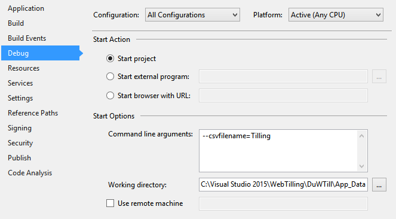
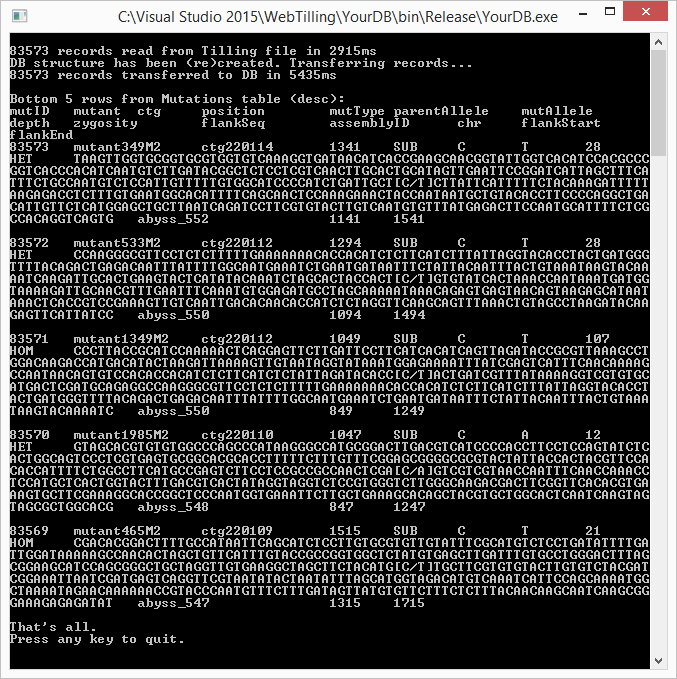

# YourDB
This project's sole purpose is to help with formatting mutations calls as an SQLite database.
* If you have no intent to substitute you own data, don't read further. Our mutations calls are already in App_Data folder of DuWTill project.
* If you prefer other means of creating SQLite database, say [Mozilla add-on](https://addons.mozilla.org/en-US/firefox/addon/sqlite-manager-webext/), do it. But refer to the table description below and in Program.cs.
* If you want to switch to SQL Server, you can do it too with the appropriate **solution configuration** (not discussed here as part of this distribution). We tried SQLExpress and full blown SQL Server.
* If you need to substitute the reference as well, follow the instructions in README in DuWTill project on how to create blastable database.

We presume that you've called mutations by following our pipeline [ref] or by other means. Then,

1. Format mutations calls as a comma separated values (csv) file with column names in the first row. Column names (in any order) are the same as database fields:
   * *mutID*	- unique mutation number, a.k.a. internal ID
   * *mutant* - identifier of the individual plant harbouring a mutation of interest, like "TA00285-7_mutant342_M2"
   * *ctg*	- name of contig using internal reference nomenclature
   * *position* - mutation position in bases relative to the start of the respective reference contig	
   * *mutType*	- induced mutation type, SUB/DEL/INS
   * *parentAllele* - nucleotide base at the position in the non-mutagenized control 'parent'
   * *mutAllele*	- base call at the position in the EMS-mutagenized individual
   * *depth*	- number of reads at the mutation position, mutant allele coverage
   * *zygosity* - predicted zygosity of the mutation, HET/HOM
   * *flankSeq* - sequence fragment of at least 50 bp on either side of the mutation
   * *chr*	- chromosome of the sequence containing the mutation
   * *flankStart*	- start of a flanking sequence
   * *flankEnd* - end of a flanking sequence
   * *assemblyID* - optional, we kept original naming from Svevo and Kronos assemblies
2. **YourDB** is a simple console application which is better to run from within Visual Studio. Copy csv file described above into `DuWTill\App_Data` folder and set command line arguments and working directory on `YourDB->Properties->Debug` page, if required:

   

There are only three parameters to be set:

* --csvfilename, -f - name of a csv file with mutations table to read in; default: 'Tilling'
* --workingdirectory, -d - path to csv file, DB will be created in the same directory with the same name (i.e. Tilling.csv->Tilling.sqlite); default: Environment.CurrentDirectory
* --addrecords, -r - flag (!) whether to add records to existing table; default: create a new table

Program accepts short/long Linux/Windows styles, i.e. `--csvfilename=Tilling` OR `-f=Tilling` OR `/csvfilename:Tilling` OR `/f:Tilling`

3. You can now run YourDB (Ctrl+F5). The results would be similar to 

   

   Alternatively, publish, install and execute...
